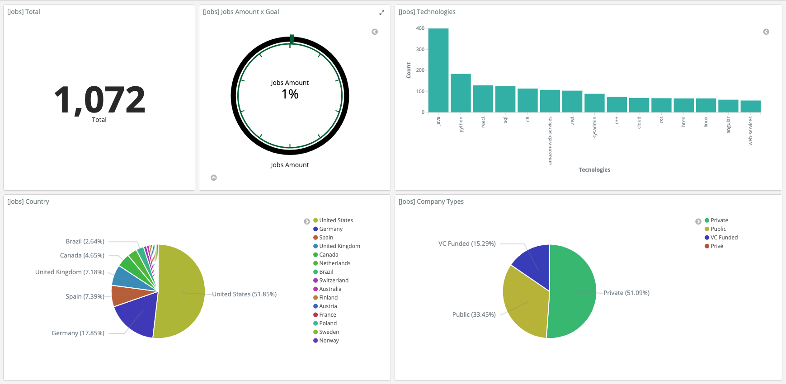

# Stackflow Crawl
A robot that capture jobs from Stack Overflow!

If you're searching for a job opportunity, this robot can help you.
I've just made a spider crawler which putting docs in a ElasticSearch database and makes possible 
use Kibana and build dashboards like this:



It's awesome because you know which country has more jobs with a determinate technology or where you earn better for certain technology.

### Requirements

- Docker
- Docker Compose
- Pip

### Environment vars

````.env
 GEOCODE_USERNAME=your_user_agent # not required
 BULK_SIZE=how_many_docs_sent_to_elasticsearch # default: 10
````

**Location**: If you want to fill geolocation fields, set GEOCODE_USERNAME how to https://github.com/geopy/geopy indicate.

### Pre Run

1 - Install dependencies with Pipenv: ```make install```   \
2 - Run necessary images: ```make compose```

### Running

Capture all jobs
````python
scrapy crawl stkflow
````

Pass city as argument
````python
scrapy crawl stkflow -a city="Nova York"
````
or kind of job

```python
scrapy crawl stkflow -a job="Software Engineer"
```

Your robot is running and you can see the result here: http://0.0.0.0:5601/app/kibana in **Discover** tab
